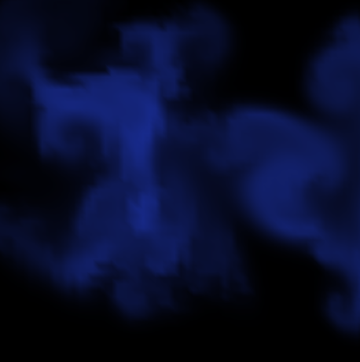
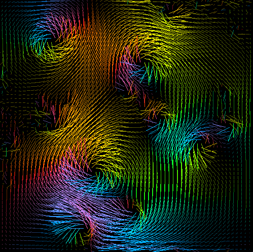
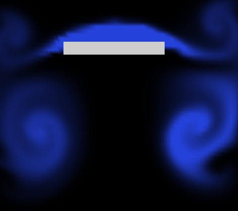
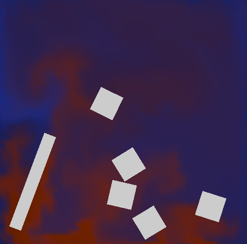

# Fluid simulation - Simulation in Computer Graphics Project 2

This project is a fluid simulation system for the TU/e course Simulation in Computer Graphics, expanding upon Jos Stam [original code](http://www.dgp.toronto.edu/people/stam/reality/Research/zip/CDROM_GDC03.zip) and his accompanying paper [_Real-Time Fluid Dynamics for Games (2003)_](https://www.cs.cmu.edu/afs/cs/academic/class/15462-s13/www/lec_slides/StamFluidforGames.pdf). Our expansion introduces additional features such as vorticity confinement, fixed and movable solid objects, collidable rigid bodies, two-way coupling, and fluids with varying temperatures. The goal of the project is to achieve visually convincing results while maintaining real-time performance.

## Project Report

For a detailed description of the implementation, experiments, and results, see the full report:

[Simulation in Computer Graphics - Project 2 Report](Simulation_in_Computer_Graphics___Project_2.pdf)

## Screenshots

Below are some example screenshots from the application:

### Normal fluid simulation

### Velocity field

### Simulation with temperature

### Solid object fluid interaction

### A bit of everything

## Requirements

To build and run this project, you need the following:

- **C++17** compatible compiler (e.g., g++, clang++)
- **OpenGL** development libraries
- **GLUT**

## Compiling and running the application

See [compile_how_to.md](compile_how_to.md).

## How to use the application

- Toggle vorticity confinement: `r`
- Toggle temperature simulation: `t`
- Toggle pressure force: `p`
- Toggle collisions: `x`
- Toggle UI info: `i`
- Add density: `spacebar`
- Switch to a given scene: `1`-`5`
- Quit application: `q`
